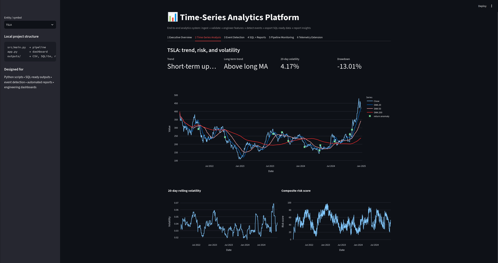
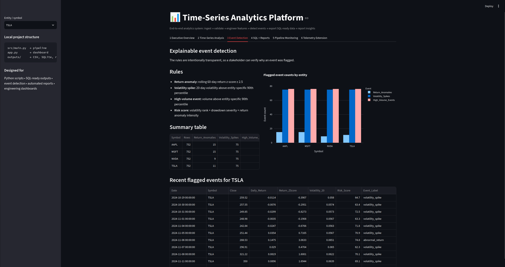
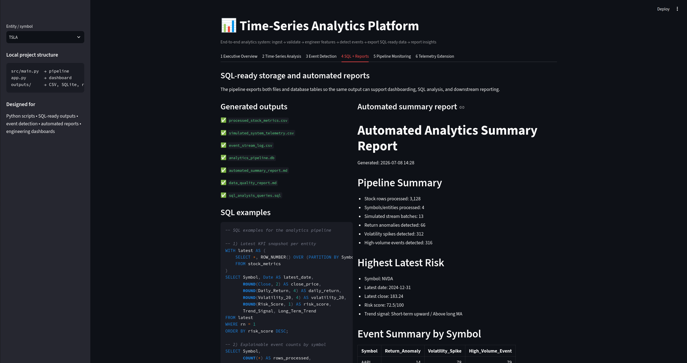

# Financial Market Analytics Platform


End-to-end time-series analytics platform for financial market data.  
The project processes raw stock data, performs feature engineering, detects important market events, exports SQL-ready analytics outputs, and presents insights through an interactive Streamlit dashboard.

---

## Overview

This project is designed as a complete applied data analytics workflow, not only as a dashboard.

It covers:

- Data ingestion for multiple stock symbols
- Data validation and cleaning
- Feature engineering for time-series analysis
- Moving average and volatility calculation
- Event and anomaly-style pattern detection
- SQL-ready analytical exports
- Automated report generation
- Interactive dashboard visualization

The goal is to convert raw time-series market data into clear, decision-ready insights.

---

## Key Features

### Time-Series Analytics
- Multi-symbol stock analysis
- Daily returns
- 50-day and 200-day moving averages
- Rolling volatility metrics
- Trend and risk comparison

### Event Detection
- Large return movement detection
- Volatility spike detection
- High-volume activity detection
- Explainable event flags instead of black-box results

### SQL-Ready Outputs
- Processed analytics tables
- SQLite database export
- Reusable SQL analysis queries
- Summary reports for reporting workflows

### Dashboard
- Executive overview
- Trend and risk analysis
- Pattern detection view
- SQL and report section
- Generic synthetic telemetry extension for demonstrating transferability of the pipeline structure


---

## Dashboard Preview

### Executive Overview


### Time-Series Trend and Risk Analysis


### Event and Pattern Detection


### SQL-Ready Outputs and Automated Reports


---

## Project Structure

```text
financial-market-analytics-platform/
├── app.py
├── README.md
├── requirements.txt
├── .gitignore
├── src/
│   └── main.py
├── docs/
│   └── architecture.md
├── outputs/
│   ├── processed_stock_metrics.csv
│   ├── processed_data.csv
│   ├── simulated_system_telemetry.csv
│   ├── event_stream_log.csv
│   ├── analytics_pipeline.db
│   ├── sql_analysis_queries.sql
│   ├── automated_summary_report.md
│   ├── data_quality_report.md
│   └── pipeline_run_log.json
└── tests/
    └── test_pipeline_basic.py

---

## Makefile Commands

Common development commands:

```bash
make install      # install dependencies
make pipeline     # run the analytics pipeline
make dashboard    # start the Streamlit dashboard
make syntax       # check Python syntax
make clean        # remove local cache files
