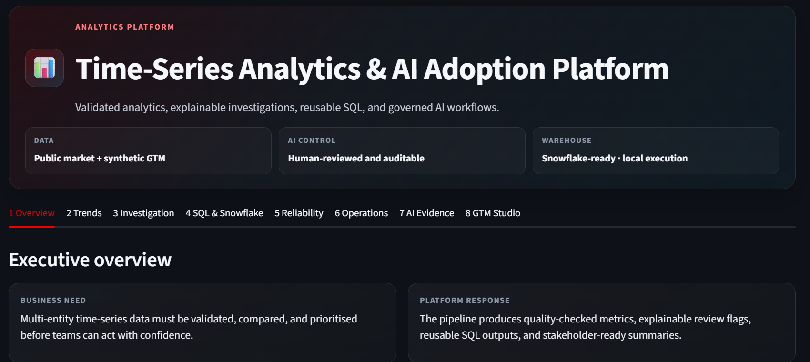

# Time-Series Analytics & AI Adoption Platform


A reproducible analytics and AI-adoption portfolio project designed to demonstrate the full Business Analyst workflow:

**ingest → validate → engineer → detect → store → explain → govern → enable**

The project uses public market data to demonstrate a reusable time-series analytics engine, then applies the same architecture to clearly labelled synthetic operational and EMEA GTM datasets. It includes SQL analysis, a local SQLite warehouse, optional Snowflake integration, Cursor-assisted workflows with repository rules and human review, auditable AI-development evidence, and a team-adoption studio.

> **Important boundary:** No Red Hat, customer, confidential, or production data is used or implied. Snowflake live mode is optional and safely disabled until explicitly configured.

## Dashboard Preview



---

## One-Click Windows Interview Run

Extract the ZIP and double-click:

```text
RUN_INTERVIEW_DEMO_WINDOWS.bat
```

The script will:

1. Create or reuse a Python virtual environment.
2. Install runtime and verification dependencies.
3. Run the complete analytics pipeline.
4. Run automated tests and preflight checks.
5. Create `outputs/verification_summary.json`.
6. Start the Streamlit dashboard.

For checks without opening Streamlit:

```text
PREFLIGHT_CHECK_WINDOWS.bat
```

---

## Dashboard Tabs

### 1. Overview

- Business problem and solution framing
- Data-quality score and review metrics
- Deterministic decision brief
- Human-context questions before action
- Governed architecture
- Direct mapping from the public demo to GTM Operations

### 2. Trends

- Moving averages and anomaly markers
- Volatility, drawdown, and trend KPIs
- Transparent risk-driver decomposition
- Cross-entity indexed comparison
- Entity benchmark table
- Correlation analysis

### 3. Investigation

- Explainable rule catalogue
- Severity and priority queue
- Event drill-down with observed facts
- Analyst follow-up questions
- Close / monitor / investigate / escalate framework

### 4. SQL & Snowflake

- Read-only SQLite query workspace
- Reusable query templates
- Local analytical table discovery
- Snowflake-ready schema, governed view, and native SQL
- Environment-based configuration and safe live-mode gating
- Data lineage, file fingerprints, and downloads

### 5. Reliability

- Data-quality controls
- Pipeline batch monitoring
- Reproducibility checklist
- Automated-test and preflight evidence
- Run metadata and generated quality report

### 6. Operations

- Synthetic operational data only
- Service and software-version health matrix
- Risk timeline, incident queue, and operational brief
- Clear mapping to business and GTM monitoring patterns

### 7. AI Evidence

- Human-in-the-loop lifecycle
- Auditable records of AI-supported tasks
- Accept / modify / reject decision discipline
- AI risk and control matrix
- Bounded prompt library
- Downloadable evidence and adoption assets

### 8. GTM Studio

- Synthetic EMEA regional KPIs
- Explainable review queue and stakeholder draft
- Tool-by-task AI use-case builder
- 30–60–90 day adoption plan
- Skill-gap and enablement matrix
- Hypothetical capacity scenario with an explicit non-measured disclaimer
- Snowflake-ready + Cursor-assisted operating model

---

## Interview Route

Use this seven-minute sequence:

```text
1 Overview
→ 2 Trends
→ 3 Investigation
→ 4 SQL, Data Model & Snowflake
→ 7 AI Evidence
→ 8 GTM Studio
```

The full speaking script is in:

```text
docs/INTERVIEW_DEMO_SCRIPT.md
```

Supporting preparation:

```text
docs/TECHNICAL_QA_BANK.md
docs/DEMO_RISK_CHECKLIST.md
```

---

## Technology Stack

- Python
- Pandas and NumPy
- Streamlit and Plotly
- SQLite
- yfinance with deterministic offline fallback
- Snowflake Connector for Python (optional)
- Snowflake-native SQL examples
- Cursor version-controlled project rules
- Pytest

---

## Project Structure

```text
financial-market-analytics-platform-main/
├── app.py
├── RUN_INTERVIEW_DEMO_WINDOWS.bat
├── PREFLIGHT_CHECK_WINDOWS.bat
├── requirements.txt
├── requirements-dev.txt
├── .streamlit/config.toml
├── .cursor/rules/analytics-quality.mdc
├── src/
│   ├── main.py
│   ├── dashboard_utils.py
│   ├── preflight.py
│   ├── gtm_demo.py
│   └── snowflake_adapter.py
├── sql/
│   ├── snowflake_gtm_schema.sql
│   └── snowflake_gtm_analysis.sql
├── docs/
│   ├── INTERVIEW_DEMO_SCRIPT.md
│   ├── TECHNICAL_QA_BANK.md
│   ├── DEMO_RISK_CHECKLIST.md
│   ├── ai_assistance_log.json
│   ├── AI_ASSISTED_DEVELOPMENT_EVIDENCE.md
│   ├── AI_ADOPTION_PLAYBOOK.md
│   ├── CURSOR_WORKFLOW.md
│   └── SNOWFLAKE_INTEGRATION.md
├── outputs/
└── tests/
```

---

## Optional Snowflake Setup

The interview demo works fully without Snowflake.

To install the optional connector:

```bash
python -m pip install -r requirements-snowflake.txt
```

Configure the documented `SNOWFLAKE_*` environment variables. Credentials are never stored in source code. Live tests and uploads remain disabled until the connector, required fields, authentication, and explicit confirmation are present.

---

## Cursor Workflow

The repository includes:

```text
.cursor/rules/analytics-quality.mdc
AGENTS.md
docs/CURSOR_WORKFLOW.md
```

The intended workflow is:

```text
explicit file context → bounded task → plan before edits → review diff → test → validate analysis → document decision
```

The human owner retains responsibility for privacy, data quality, architecture, accepted changes, SQL execution, and final stakeholder communication.

---

## Disclaimer

This project is for educational, portfolio, and interview demonstration purposes. It is not a production trading system and does not provide financial advice.
