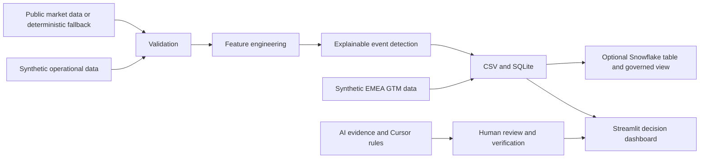

# Project Architecture

## Core Design Principles

1. Stable local demo with deterministic fallback.
2. Clear separation between public, synthetic, and optional live data.
3. Explainable rules instead of unsupported black-box conclusions.
4. Reusable SQL and storage outside the dashboard.
5. Human ownership of AI-assisted decisions.
6. Optional Snowflake integration without embedded credentials.
7. Version-controlled Cursor rules and auditable evidence.
